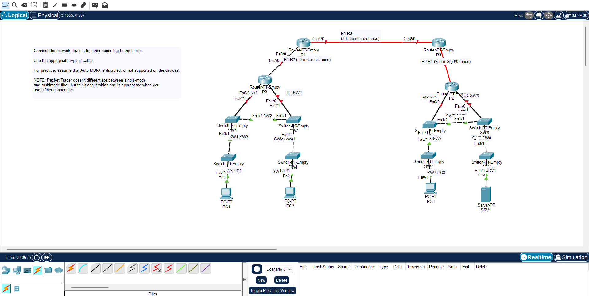

# Connecting Devices
In this lab we are asked to connect these devices with proper cables

# Connecting PCs to switches
since we assume there is no Auto MDI-X, PCs sends data with the pins 1,2 and switch accepts it with 1,2
that's why we will use straight-through cable to connect these devices.

# Connecting 2 switches
switch send data with 3,6 pins and accept with 1,2. if we want to connect 2 switches and avoid collasion we will use crossover cable.

# Connecting routers and switches 
since the distance is 50 meters we can use straight-through (routers also send with 1,2 and accept with 3,6)
but second router and switch has 250 meter distance thats why we use multimode fiber (which can we use it up to 500m)

# Connecting routers
the difference between them is 3km which is too much for miltimode fiber cable. thats why we have to use single-mode fiber cable (which can be up to 30-40km)
