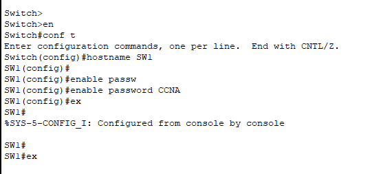
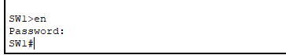
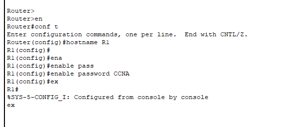
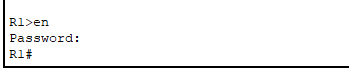

# Basic Device security

These are the tasks of the lab. this lab helps us to understand CLI modes in cisco devices and password types

Using "enable" or "en" we enter the priviliged EXEC mode.
then we use "hostname" command to change the name of the device
"enable password" allows us to set a password so everyone cant enter the Switch

we wrote "ex" or "exit" to go back to user EXEC mode, so we can check if the password is actually working or not.
as we can see it requires a password from us.

We do the same for Router:

Now we use sh run command to see displays the current active configuration running in the temporary random-access memory (RAM) of a router or switch

As you can see the password is stored in plain text which is not good for security. we need to encrypt it.

We used "service password-encryption" command to encrypt the password. but this is not very strong. it can be solved in a few seconds.

